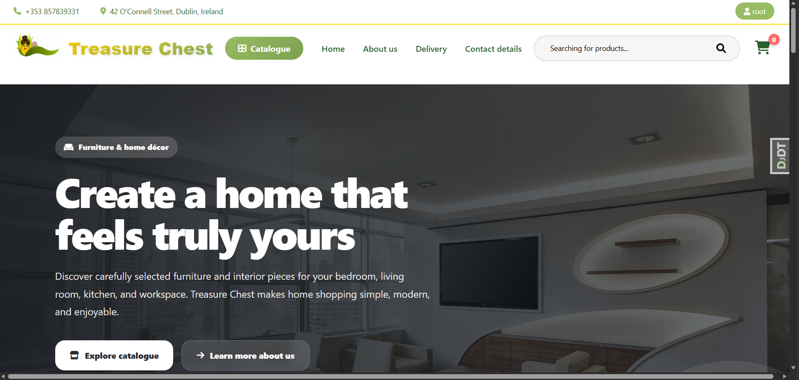
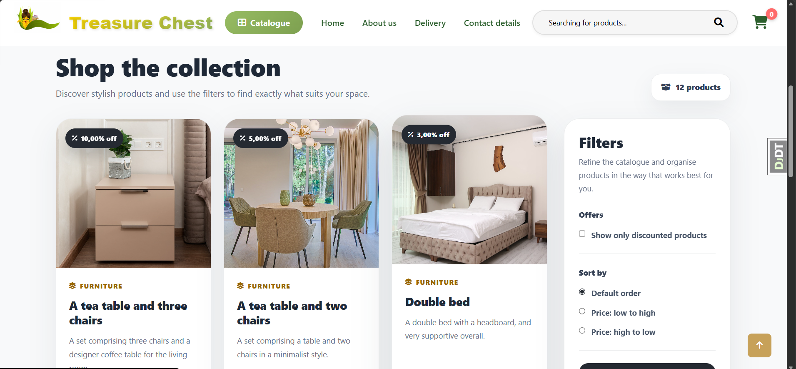
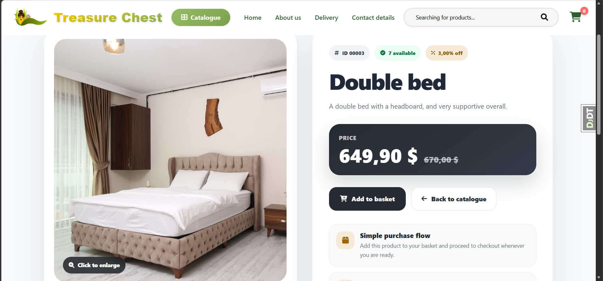
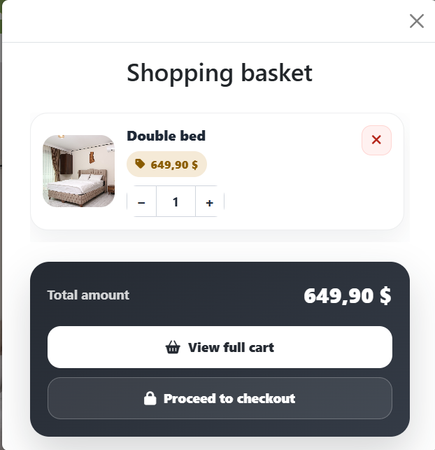
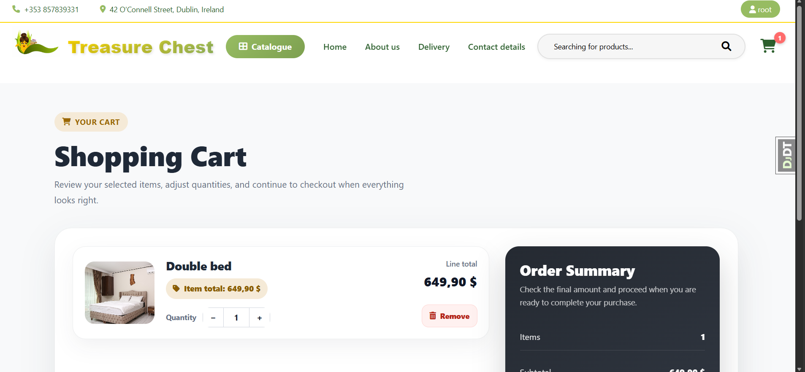
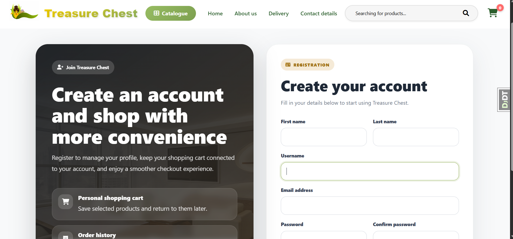

# 🛒 E-Commerce Web Application

<div align="center">

A modern full-stack e-commerce platform built with **Django** and **PostgreSQL**, featuring a responsive storefront, user authentication, hybrid shopping cart logic, AJAX-powered interactions, and a reliable checkout flow.

<br>


<br>

</div>

---

## ✨ Overview

This project is a full-featured online store designed to simulate the core functionality of a real e-commerce product. It includes a clean user interface, dynamic cart behaviour, secure authentication, and structured backend logic for catalog browsing, checkout, and order processing.

The application was built with a focus on:

* clean backend architecture;
* practical e-commerce workflows;
* smooth user experience;
* database reliability;
* modular and maintainable Django app structure.

---

## 🚀 Key Features

### 🛍 Product Browsing

* Product catalog with categories
* Individual product detail pages
* Clean card-based product layout
* User-friendly navigation between store pages

### 👤 Authentication & User Accounts

* User registration and login
* Logout flow
* Personal profile page
* Password reset functionality
* Google authentication support

### 🛒 Hybrid Shopping Cart

* Session-based cart for guest users
* Database-backed cart for authenticated users
* Automatic cart merging after login
* Quantity updates and item removal
* AJAX-powered cart interactions without full page reloads

### 📦 Checkout & Orders

* Order creation flow
* Cart-to-order conversion
* Atomic checkout transactions for better data consistency
* Structured order processing logic

### 🎨 UI & UX

* Responsive modern interface
* Refined authentication pages
* Updated catalog, product, cart, and profile screens
* Reusable layout components and consistent visual style

---

## 🧰 Tech Stack

| Area           | Technologies                     |
| -------------- | -------------------------------- |
| Backend        | Python, Django                   |
| Database       | PostgreSQL                       |
| Frontend       | HTML, CSS, JavaScript, Bootstrap |
| Dynamic UI     | AJAX                             |
| Authentication | Django Auth, Google OAuth        |
| Development    | Git, GitHub                      |

---

## 📸 Screenshots

> Add project screenshots to the `screenshots/` folder and keep the filenames below for instant compatibility with this README.

### 🏠 Home Page



### 🗂 Product Catalog



### 🪑 Product Details



### 🛒 Mini Cart



### 🧺 Full Cart Page



### 🔐 Authentication

| Login                                     | Registration                                    |
| ----------------------------------------- | ----------------------------------------------- |
|  |  |

### 👤 User Profile


### 💳 Checkout


---

## 🏗 Project Structure

```text
Web-App/
│
├── app/                 # Core project settings and global URLs
├── carts/               # Cart logic and cart templates
├── goods/               # Product catalog, categories, product pages
├── orders/              # Checkout and order processing
├── users/               # Authentication, profile, password reset
├── static/              # CSS, JavaScript, images
├── media/               # Uploaded product media
├── screenshots/         # README screenshots
│
├── manage.py
├── requirements.txt
└── README.md
```

---

## ⚙️ Local Setup

### 1. Clone the repository

```bash
git clone https://github.com/bohdankukuruza/Web-App.git
cd Web-App
```

### 2. Create and activate a virtual environment

```bash
python -m venv venv
```

#### Windows

```bash
venv\Scripts\activate
```

#### macOS / Linux

```bash
source venv/bin/activate
```

### 3. Install dependencies

```bash
pip install -r requirements.txt
```

### 4. Configure environment variables

Create a `.env` file in the project root:

```env
SECRET_KEY=your_secret_key
DEBUG=True

DB_NAME=your_database_name
DB_USER=your_database_user
DB_PASSWORD=your_database_password
DB_HOST=localhost
DB_PORT=5432

EMAIL_HOST_USER=your_email
EMAIL_HOST_PASSWORD=your_email_password

GOOGLE_CLIENT_ID=your_google_client_id
GOOGLE_CLIENT_SECRET=your_google_client_secret
```

### 5. Apply migrations

```bash
python manage.py migrate
```

### 6. Create an admin account

```bash
python manage.py createsuperuser
```

### 7. Run the development server

```bash
python manage.py runserver
```

Open the app locally:

```text
http://127.0.0.1:8000/
```

---

## 🔍 Engineering Highlights

### Session-to-Database Cart Merge

Guest users can add products before logging in. Once authenticated, the session cart is merged with the user's stored cart, preserving items and creating a seamless transition.

### AJAX Cart Updates

The cart supports live quantity changes and removals through asynchronous requests, improving responsiveness and avoiding unnecessary page reloads.

### Transaction-Safe Checkout

Checkout logic is implemented with atomic database transactions to reduce the risk of partial order creation and maintain reliable state changes.

### Modular Django Design

The project is split into focused applications such as `goods`, `carts`, `orders`, and `users`, improving readability, maintainability, and future scalability.

---

## 🧭 Planned Improvements

* Online payment integration
* Wishlist functionality
* Product reviews and ratings
* Improved order history section
* Advanced product filtering and search
* Production deployment and domain setup

---

## 👨‍💻 Author

**Bohdan Kukuruza**
Computer Science Student at Dublin City University

---

<div align="center">

⭐ If you found this project interesting, feel free to star the repository.

</div>
